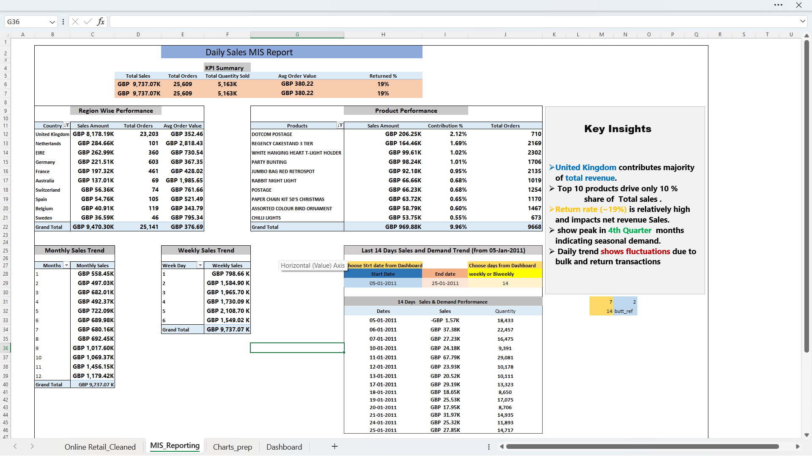
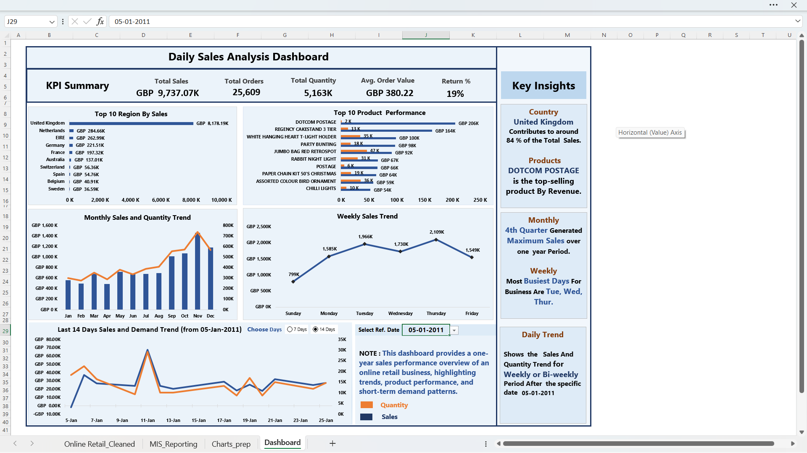

# 📊 Online Retail MIS Analysis (UCI Dataset)

---

## 📌 Project Overview

This project simulates a real-world **MIS (Management Information System) reporting workflow** using transactional retail data.

The goal is to transform raw, messy ERP-style data into a structured analytical model and generate meaningful business insights through **dynamic MIS reporting and dashboarding**.

---

## 🎯 Business Objective

* Track daily sales performance
* Identify top-performing products and regions
* Monitor returns and anomalies
* Enable short-term (7/14 days) trend analysis
* Support management decision-making with structured reports

---

## 🛠 Tools & Technologies Used

* Microsoft Excel
* Power Pivot (Data Model)
* DAX Measures
* Pivot Tables & Charts
* Data Validation & Form Controls

---

## 📁 Dataset

* Source: UCI Online Retail Dataset
* Size: ~500,000 transactional records

### Key Fields:

* Invoice Number
* StockCode & Description
* Quantity
* Unit Price
* Customer ID
* Country
* Invoice Date

---

## 🧹 Data Cleaning & Preparation

### 🔍 Challenges Identified

* Missing Customer IDs
* Missing Product Descriptions
* Invalid / empty records
* Special characters & inconsistent product names
* Zero or incorrect pricing
* Negative quantities (returns)

---

### ✅ Cleaning Steps Performed

* Mapped missing descriptions using **StockCode**
* Removed ~216 invalid records (no usable information)
* Retained null Customer IDs (valid business scenario)
* Created **Return Flag** using negative quantity logic
* Removed ~75 corrupted description records
* Validated pricing anomalies

---

## 🧠 Key Data Insights (Cleaning Phase)

* Returns are significant and must be handled separately
* Some transactions are anonymous (no customer ID)
* Product descriptions are inconsistent → require standardization
* Data cleaning is critical before any reporting

---

## 📊 Data Modeling & Feature Engineering

* Created derived columns:

  * Sales = Quantity × Unit Price
  * Year, Month, Weekday

* Created DAX measures:

  * Total Sales
  * Total Orders (Distinct Invoice)
  * Total Quantity
  * Average Order Value
  * Return % (Order-level logic)

---

## 📊 MIS Report Features

The MIS report includes:

* KPI Summary (Sales, Orders, AOV, Return %)
* Region-wise Performance
* Product-wise Performance (Top Contributors)
* Monthly Sales Trend
* Weekly Sales Pattern
* Dynamic Daily Trend (7 / 14 Days)
* Returns Analysis
* Business Insights Panel

---

## 📊 Dashboard Features (Final Output)

* Clean and structured MIS dashboard layout
* Dynamic **Date Selector (Data Validation)**
* Toggle between **7-day and 14-day trend analysis**
* Interactive daily sales & quantity visualization
* Top-performing regions and products
* Business insights for decision-making

---

## 🧠 Key Business Insights

* 🇬🇧 United Kingdom contributes ~84% of total revenue
* 📦 Revenue is highly concentrated in top-performing products
* 📈 Sales peak observed in **4th quarter (seasonality effect)**
* 📅 Mid-week days (Tue–Thu) show highest activity
* 🔄 Return rate (~19%) significantly impacts net performance

---

## 🚀 Project Approach

1. Data Cleaning & Validation
2. Feature Engineering
3. Data Modeling (Power Pivot)
4. Measure Creation (DAX)
5. MIS Report Development
6. Dashboard Design
7. Insight Generation

---

## 📊 MIS Report Preview

---

## 📊 Dashboard Preview

---

## 📄 Detailed Documentation

For deeper understanding of logic and implementation:

👉 [View MIS Report Details](docs/mis_report_details.md)

---

## 🏆 Key Learnings

* Handling large-scale transactional datasets (~500K rows)
* Real-world data cleaning and anomaly handling
* Writing DAX measures for business metrics
* Difference between **transaction-level vs order-level analysis**
* Designing MIS reports vs dashboards
* Creating dynamic time-based analysis (7/14 days logic)

---
